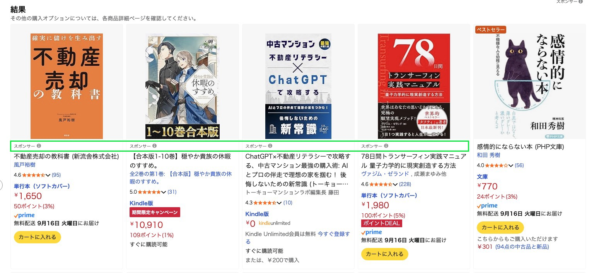
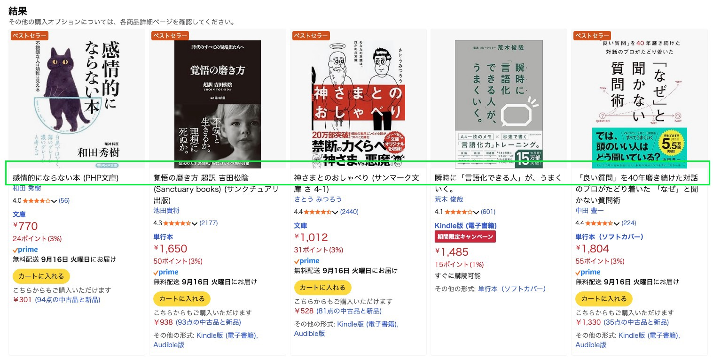

# chrome-amazon-ad-hider

Amazon ページでおすすめ・スポンサー商品を非表示にする Chrome 拡張機能です。

## 概要

この拡張機能は、Amazon の検索結果ページなどから以下の要素を非表示にします。

- おすすめ商品
- スポンサー広告

## 使用前後の比較

### 拡張機能使用前

スポンサー商品が表示されます

### 拡張機能使用後

スポンサー商品が表示されません

## インストール方法

この拡張機能は Chrome ウェブストア には公開していません。

以下の手順で手動インストールが可能です。

1. このリポジトリをクローンまたはダウンロード
2. Chrome で `chrome://extensions/` を開く
3. 右上の「デベロッパーモード」を有効にする
4. 「パッケージ化されていない拡張機能を読み込む」をクリック
5. ダウンロードしたフォルダを選択
